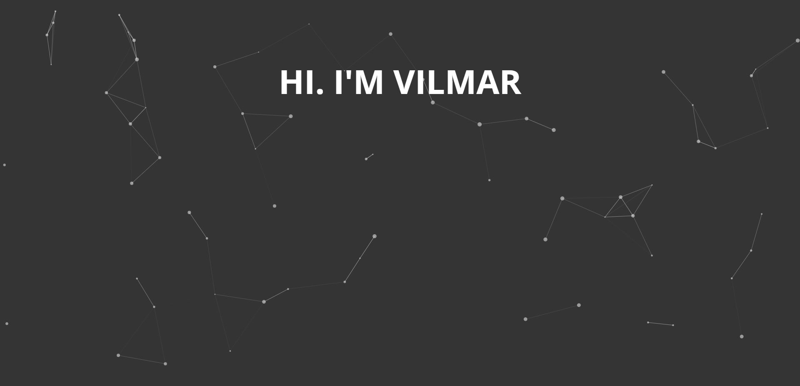

[//]: # 'IMG SHIELDS FROM: https://github.com/alexandresanlim/Badges4-README.md-Profile'

<h2><samp>👋 Hi</samp></h2>

<samp>
    <ul>
        <li><strong>What I'm currently building?</strong>
            <ul>
                <li> <i>Entropiya <a href="https://github.com/vilmarcabanero/entropiya-client">📦</a> </i>
                    <ul>
                        <li>Entropiya is an educational website which provides online review for licensure exam takers. </li>
                        <li>This is written in React and Node / Express.</li>
                    </ul>
                </li>
                <li> <i> Niventa <a href="https://github.com/vilmarcabanero/niventa-client">📦</a> </i>
                    <ul>
                        <li>Niventa is an e-commerce website, which envisions to be a full fledged production ready website that will be used by online sellers of Burauen, Leyte. </li>
                        <li>This is also written in React and Node / Express.</li>
                    </ul>
                </li>
                <li> <i> Portfolio <a href="https://github.com/vilmarcabanero/vilmarcabanero">📦</a> </i>
                    <ul>
                        <li>This is my official portfolio website.</li>
                        <li>This is also written in React and for the design, I just used Vanilla CSS.</li>
                    </ul>
                </li>
            </ul>
        </li> 
        <li><strong>What I'm planning to study?</strong>
            <ul>
                <li>React Native (Mobile Apps) 📱</li>
                <li>Electron JS (Desktop Apps) 💻</li>
            </ul>
        </li>
    </ul>
</samp>

<h2><samp>📈 GITHUB STATISTICS</samp></h2>

<!--  -->

<h2><samp>💪 STRONG STACK</samp></h2>

    
    
    
    

<h2><samp>🎨 FRONTEND TECHNOLOGIES</samp></h2>

     
    
    
    
    
    
    
    
    
    

<h2><samp>💻 BACKEND TECHNOLOGIES</samp></h2>

    
    
    
    

<h2><samp>🙊 DATABASE MANAGEMENT SYSTEM</samp></h2>

    

<h2><samp>🌏 SERVER</samp></h2>

    
    

<h2><samp>🔧 DEVELOPMENT TOOLS</samp></h2>

    
    
    
    
    
    
    
    
    

